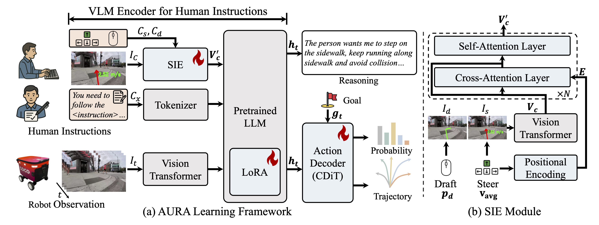
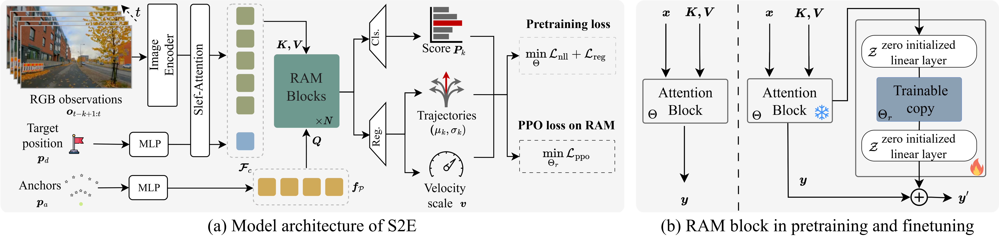
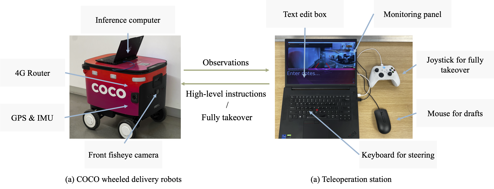

<div class="embed-responsive embed-responsive-16by9">
  <video muted autoplay playsinline controls loop style="position: absolute; top: 0%; left: 0%; width: 100%; height: 100%;">
        <source src="../assets/projects/aura/teaser.mp4" type="video/mp4"> 
        Your browser does not support the video tag.
    </video>
</div>

<div class="research-section">
    <h3 style="text-align: center">TL;DR</h3>
    <ul style="list-style-type: none; padding-left: 0;">
      <!-- <strong>S2E</strong> is a <em>unified</em> learning framework that scales navigation foundation models from passive offline video to interactive decision-making through reinforcement learning.<br><br>
    1. 📦 Provides a general framework for learning navigation from both offline data and online interaction.<br>
    2. 🔌 Introduces a plug-and-play <strong>Residual-Attention Module</strong> for efficient adaptation and scaling in RL.<br>
    3. 🧭 Releases <strong>NavBench-GS</strong>, a realistic 3D Gaussian Splatting benchmark for evaluating navigation performance in closed-loop, interactive, and physically grounded environments. -->
    <strong>AURA</strong> (<em>Assistive Urban Robot Autonomy</em>) is a multimodal shared-autonomy framework that decomposes real-world urban navigation into <em>high-level human instruction</em> and <em>low-level AI control</em>, reducing operator burden while improving stability.<br><br>

🤝 Enables shared autonomy without forcing humans and AI to operate in the same action space, lowering cognitive overhead.<br>
🧠 Introduces a <strong>Spatial-Aware Instruction Encoder</strong> to align human instructions with visual and spatial context for robust instruction following.<br>
🧪 Proposes a <strong>pseudo-simulation shared-control testing pipeline</strong> with a judgment module that simulates human takeovers, enabling scalable evaluation of takeover/operation frequency and stability in practice.<br>
  </ul>
</div>

<!--research-section-splitter-->
## AURA Model architecture
<div class="img-container" style="width: 100%; margin: 0 auto;">
  
</div>
AURA pipeline consists of two key components:<br> (1) <strong>Multimodal Instruction Encoder + VLM Backbone</strong>: A multimodal encoder that turns egocentric RGB observations and human instructions into fused vision-language-instruction tokens. Human guidance is injected via a special instruction token produced by the <strong>Spatial-Aware Instruction Encoder (SIE)</strong>, which grounds draft/steering prompts with modality-specific geometric embeddings and fuses them with instruction visuals through cross-/self-attention; the tokens are then processed by an InternVL3-2B backbone with LoRA adaptation.<br> (2) <strong>Anchor-Initialized Diffusion Action Decoder (DiT)</strong>: A diffusion-based policy executor that generates multi-modal future trajectories conditioned on context features, navigation goals, and timestep embeddings. Instead of starting from Gaussian noise, it initializes from 64 trajectory anchors (motion primitives clustered from UrbanWalks), then denoises via a lightweight Transformer to output refined trajectories and confidence scores for control.


<!-- ## S2E Model architecture

<div class="img-container" style="width: 100%; margin: 0 auto;">
    
</div>
 
S2E pipeline consists of two key components:<br>
(1) Anchor-Guided Distribution Matching: A framework that uses anchor-conditioned architecture to learn multi-modal trajectory distributions from offline real-world videos, improving model capability from the side of representation.<br>
(2) Residual Attention Module: A lightweight residual design that fine-tunes pretrained attention blocks via reinforcement learning in simulation, enabling new behaviors (e.g., obstacle avoidance) while preserving general visual-motor priors. -->

<!--research-section-splitter-->

## Real-World Demo Visualizations Across Interfaces

### ✏️ Draft

<div class="img-container" style="width: 100%; margin: 0 auto;">
  <video id="aura-draft-player" muted autoplay playsinline controls style="width: 100%; height: auto;">
    <source src="../assets/projects/aura/draft_1.mp4" type="video/mp4">
    Your browser does not support the video tag.
  </video>
</div>

<p id="aura-draft-caption" style="text-align: center; font-size: 0.95rem; color: #666; margin-top: 0.6rem;">
  <strong>Draft 1.</strong> AURA follows high-level drafting guidance to complete instruction-following navigation in a real-world sidewalk scene.
</p>

<div style="display: flex; justify-content: center; align-items: center; gap: 10px; margin-top: 0.6rem;">
  <button id="aura-draft-prev" type="button" style="padding: 0.35rem 0.7rem; border: 1px solid #ccc; border-radius: 6px; background: #fff;">&#8592; Prev</button>
  <span id="aura-draft-label" style="font-size: 0.95rem; color: #555;">Draft 1 / 3</span>
  <button id="aura-draft-next" type="button" style="padding: 0.35rem 0.7rem; border: 1px solid #ccc; border-radius: 6px; background: #fff;">Next &#8594;</button>
</div>

<script>
  (function() {
    const videos = [
      {
        src: "../assets/projects/aura/draft_1.mp4",
        caption: "<strong>Draft 1.</strong> The robot transitions from the crosswalk to the sidewalk while navigating around a lamp post."
      },
      {
        src: "../assets/projects/aura/draft_2.mp4",
        caption: "<strong>Draft 2.</strong> The robot makes a slight right turn to avoid a tree along the sidewalk."
      },
      {
        src: "../assets/projects/aura/draft_3.mp4",
        caption: "<strong>Draft 3.</strong> The robot traverses a crowded area with parked cars."
      }
    ];
    let idx = 0;

    const player = document.getElementById("aura-draft-player");
    const label = document.getElementById("aura-draft-label");
    const caption = document.getElementById("aura-draft-caption");
    const prevBtn = document.getElementById("aura-draft-prev");
    const nextBtn = document.getElementById("aura-draft-next");
    if (!player || !label || !caption || !prevBtn || !nextBtn) return;

    function render() {
      player.src = videos[idx].src;
      player.load();
      const playPromise = player.play();
      if (playPromise && typeof playPromise.catch === "function") playPromise.catch(function() {});
      label.textContent = "Draft " + (idx + 1) + " / " + videos.length;
      caption.innerHTML = videos[idx].caption;
    }

    prevBtn.addEventListener("click", function() {
      idx = (idx - 1 + videos.length) % videos.length;
      render();
    });
    nextBtn.addEventListener("click", function() {
      idx = (idx + 1) % videos.length;
      render();
    });
    player.addEventListener("ended", function() {
      idx = (idx + 1) % videos.length;
      render();
    });
  })();
</script>

### ⌨️ Steer

<div class="img-container" style="width: 100%; margin: 0 auto;">
  <video id="aura-steer-player" muted autoplay playsinline controls style="width: 100%; height: auto;">
    <source src="../assets/projects/aura/steer_1.mp4" type="video/mp4">
    Your browser does not support the video tag.
  </video>
</div>

<p id="aura-steer-caption" style="text-align: center; font-size: 0.95rem; color: #666; margin-top: 0.6rem;">
  <strong>Steer 1.</strong> Under steer-mode interaction, the operator provides directional steering guidance while AURA stabilizes low-level trajectory execution.
</p>

<div style="display: flex; justify-content: center; align-items: center; gap: 10px; margin-top: 0.6rem;">
  <button id="aura-steer-prev" type="button" style="padding: 0.35rem 0.7rem; border: 1px solid #ccc; border-radius: 6px; background: #fff;">&#8592; Prev</button>
  <span id="aura-steer-label" style="font-size: 0.95rem; color: #555;">Steer 1 / 3</span>
  <button id="aura-steer-next" type="button" style="padding: 0.35rem 0.7rem; border: 1px solid #ccc; border-radius: 6px; background: #fff;">Next &#8594;</button>
</div>

<script>
  (function() {
    const videos = [
      {
        src: "../assets/projects/aura/steer_1.mp4",
        caption: "<strong>Steer 1.</strong> The robot makes a slight left adjustment to avoid colliding with the roadside planter."
      },
      {
        src: "../assets/projects/aura/steer_2.mp4",
        caption: "<strong>Steer 2.</strong> The robot turns slightly left to avoid thin pillars that are difficult to perceive."
      },
      {
        src: "../assets/projects/aura/steer_3.mp4",
        caption: "<strong>Steer 3.</strong> The robot makes a slight right turn to avoid a traffic cone."
      }
    ];
    let idx = 0;

    const player = document.getElementById("aura-steer-player");
    const label = document.getElementById("aura-steer-label");
    const caption = document.getElementById("aura-steer-caption");
    const prevBtn = document.getElementById("aura-steer-prev");
    const nextBtn = document.getElementById("aura-steer-next");
    if (!player || !label || !caption || !prevBtn || !nextBtn) return;

    function render() {
      player.src = videos[idx].src;
      player.load();
      const playPromise = player.play();
      if (playPromise && typeof playPromise.catch === "function") playPromise.catch(function() {});
      label.textContent = "Steer " + (idx + 1) + " / " + videos.length;
      caption.innerHTML = videos[idx].caption;
    }

    prevBtn.addEventListener("click", function() {
      idx = (idx - 1 + videos.length) % videos.length;
      render();
    });
    nextBtn.addEventListener("click", function() {
      idx = (idx + 1) % videos.length;
      render();
    });
    player.addEventListener("ended", function() {
      idx = (idx + 1) % videos.length;
      render();
    });
  })();
</script>

### 💬 Text

<div class="img-container" style="width: 100%; margin: 0 auto;">
  <video id="aura-text-player" muted autoplay playsinline controls style="width: 100%; height: auto;">
    <source src="../assets/projects/aura/text_1.mp4" type="video/mp4">
    Your browser does not support the video tag.
  </video>
</div>

<p id="aura-text-caption" style="text-align: center; font-size: 0.95rem; color: #666; margin-top: 0.6rem;">
  <strong>Text 1.</strong> In text-mode interaction, operators provide natural-language instructions while AURA converts language guidance into stable low-level navigation behavior.
</p>

<div style="display: flex; justify-content: center; align-items: center; gap: 10px; margin-top: 0.6rem;">
  <button id="aura-text-prev" type="button" style="padding: 0.35rem 0.7rem; border: 1px solid #ccc; border-radius: 6px; background: #fff;">&#8592; Prev</button>
  <span id="aura-text-label" style="font-size: 0.95rem; color: #555;">Text 1 / 3</span>
  <button id="aura-text-next" type="button" style="padding: 0.35rem 0.7rem; border: 1px solid #ccc; border-radius: 6px; background: #fff;">Next &#8594;</button>
</div>

<script>
  (function() {
    const videos = [
      {
        src: "../assets/projects/aura/text_1.mp4",
        caption: "<strong>Text 1.</strong>"
      },
      {
        src: "../assets/projects/aura/text_2.mp4",
        caption: "<strong>Text 2.</strong>"
      },
      {
        src: "../assets/projects/aura/text_3.mp4",
        caption: "<strong>Text 3.</strong>"
      }
    ];
    let idx = 0;

    const player = document.getElementById("aura-text-player");
    const label = document.getElementById("aura-text-label");
    const caption = document.getElementById("aura-text-caption");
    const prevBtn = document.getElementById("aura-text-prev");
    const nextBtn = document.getElementById("aura-text-next");
    if (!player || !label || !caption || !prevBtn || !nextBtn) return;

    function render() {
      player.src = videos[idx].src;
      player.load();
      const playPromise = player.play();
      if (playPromise && typeof playPromise.catch === "function") playPromise.catch(function() {});
      label.textContent = "Text " + (idx + 1) + " / " + videos.length;
      caption.innerHTML = videos[idx].caption;
    }

    prevBtn.addEventListener("click", function() {
      idx = (idx - 1 + videos.length) % videos.length;
      render();
    });
    nextBtn.addEventListener("click", function() {
      idx = (idx + 1) % videos.length;
      render();
    });
    player.addEventListener("ended", function() {
      idx = (idx + 1) % videos.length;
      render();
    });
  })();
</script>
<!--research-section-splitter-->

<!-- ## NavBench-GS: Closed-Loop 3DGS Navigation Benchmark

<div class="embed-responsive embed-responsive-16by9">
  <video muted autoplay playsinline controls loop style="position: absolute; top: 0%; left: 0%; width: 100%; height: 100%;">
        <source src="../assets/projects/s2e/navbench_gs.mp4" type="video/mp4">
        Your browser does not support the video tag.
    </video>
</div>

We build NavBench-GS, a 3D Gaussian Splatting-based benchmark for evaluating navigation policies in closed-loop, visually reconstructed urban environments with simulated objects and pedestrians. -->


<!--research-section-splitter-->
## Real-World Deployment

### Teleoperation Platform

<div class="img-container" style="width: 100%; margin: 0 auto;">
  
</div>

<!-- <p style="text-align: center; font-size: 0.95rem; color: #666; margin-top: 0.6rem;"> -->
We evaluate the instruction-following performance of our model on COCO wheeled delivery robots. The platform includes both the onboard robotic infrastructure and a teleoperation interface for monitoring and control. During testing, the inference computer is placed inside the COCO robot's storage compartment.
<!-- </p> -->


### Long-Horizon Navigation

<div class="img-container" style="width: 100%; margin: 0 auto;">
  <video id="aura-long-player" muted autoplay playsinline controls style="width: 100%; height: auto;">
    <source src="../assets/projects/aura/long_1.mp4" type="video/mp4">
    Your browser does not support the video tag.
  </video>
</div>

<p id="aura-long-caption" style="text-align: center; font-size: 0.95rem; color: #666; margin-top: 0.6rem;">
  <strong>Long 1.</strong>
</p>

<div style="display: flex; justify-content: center; align-items: center; gap: 10px; margin-top: 0.6rem;">
  <button id="aura-long-prev" type="button" style="padding: 0.35rem 0.7rem; border: 1px solid #ccc; border-radius: 6px; background: #fff;">&#8592; Prev</button>
  <span id="aura-long-label" style="font-size: 0.95rem; color: #555;">Long 1 / 2</span>
  <button id="aura-long-next" type="button" style="padding: 0.35rem 0.7rem; border: 1px solid #ccc; border-radius: 6px; background: #fff;">Next &#8594;</button>
</div>

<script>
  (function() {
    const videos = [
      {
        src: "../assets/projects/aura/long_1.mp4",
        caption: "<strong>Long 1.</strong>"
      },
      {
        src: "../assets/projects/aura/long_2.mp4",
        caption: "<strong>Long 2.</strong>"
      }
    ];
    let idx = 0;

    const player = document.getElementById("aura-long-player");
    const label = document.getElementById("aura-long-label");
    const caption = document.getElementById("aura-long-caption");
    const prevBtn = document.getElementById("aura-long-prev");
    const nextBtn = document.getElementById("aura-long-next");
    if (!player || !label || !caption || !prevBtn || !nextBtn) return;

    function render() {
      player.src = videos[idx].src;
      player.load();
      const playPromise = player.play();
      if (playPromise && typeof playPromise.catch === "function") playPromise.catch(function() {});
      label.textContent = "Long " + (idx + 1) + " / " + videos.length;
      caption.innerHTML = videos[idx].caption;
    }

    prevBtn.addEventListener("click", function() {
      idx = (idx - 1 + videos.length) % videos.length;
      render();
    });
    nextBtn.addEventListener("click", function() {
      idx = (idx + 1) % videos.length;
      render();
    });
    player.addEventListener("ended", function() {
      idx = (idx + 1) % videos.length;
      render();
    });
  })();
</script>

<!--research-section-splitter-->

## Reference

```
@article{ma2026aura,
    title={AURA: Multimodal Shared Autonomy for Real-World Urban Navigation},
    author={Ma, Yukai and He, Honglin and Song, Selina and Wu, Wayne and Zhou, Bolei},
    journal={Computer Vision and Pattern Recognition},
    year={2026}
}
```

