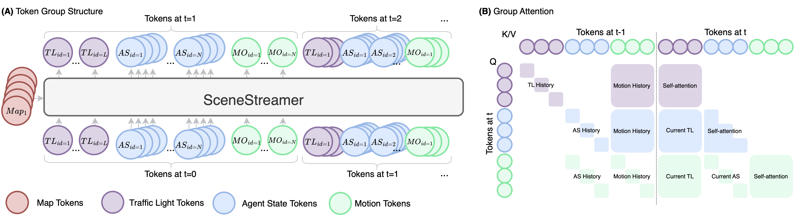
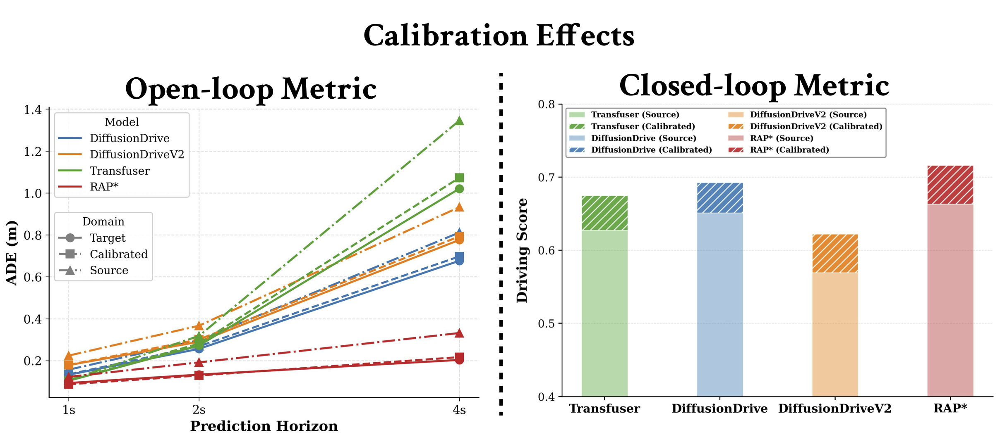
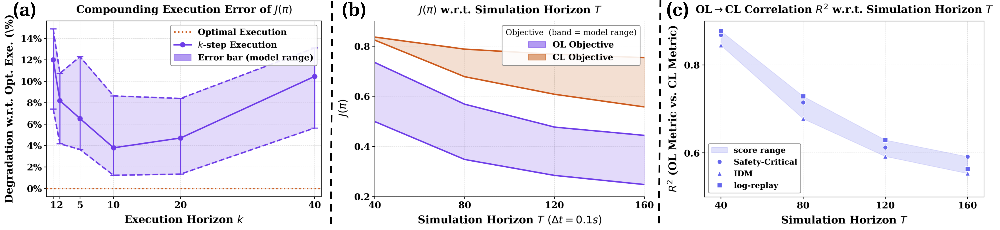
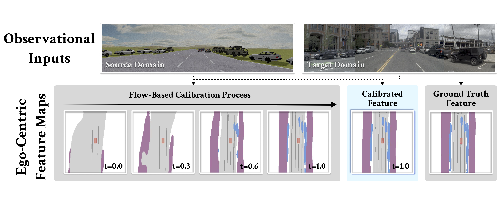
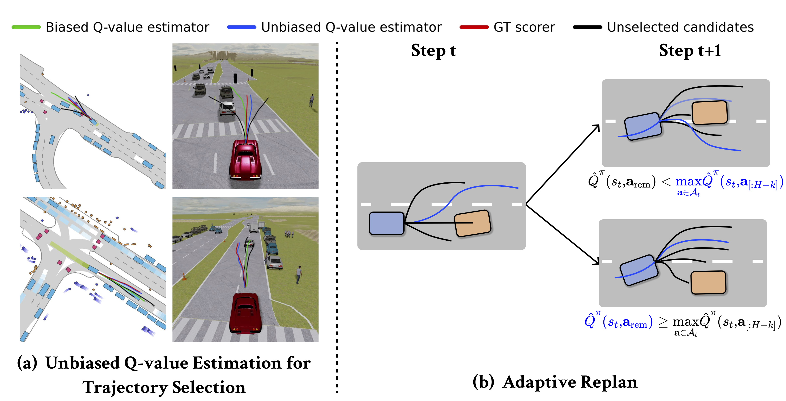
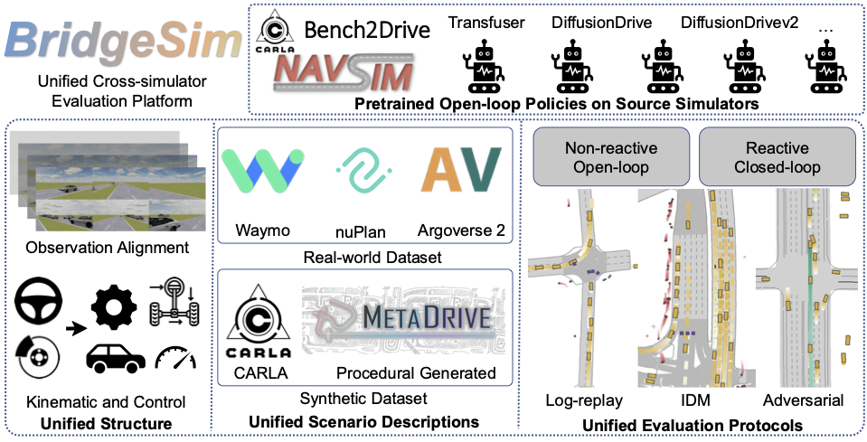

## Abstract

End-to-end autonomous driving has seen rapid progress on non-reactive simulation benchmarks such as NAVSIM, where planners are evaluated on PDMS-based metrics without environmental feedback. Yet gains on these open-loop (OL) metrics do not reliably transfer to closed-loop (CL) deployment, and the field continues to optimize for open-loop improvements. In this paper, we systematically decompose the root causes of this OL–CL deployment gap into two key factors: Information Asymmetry, resulting from observational domain shifts, and Objective Mismatch, driven by train-test optimization misalignment. Through principled analysis, we demonstrate that while Information Asymmetry is largely recoverable with standard adaptation, the primary catalyst for performance collapse is Objective Mismatch, specifically, biased Q-value estimates that fail to account for the reactive nature of the environment. We further show that under this mismatch, improving open-loop accuracy or scaling test-time computation over the open-loop objective yields diminishing or negative closed-loop returns. To this end, we propose a Test-Time Adaptation (TTA) framework that mitigates observational shift and debiases action-value estimates in inference time. Extensive experiments show that TTA effectively mitigates these biases and exhibits more favorable scaling dynamics than its baseline counterparts. Given these findings, we suggest the community reassess the prevailing reliance on non-reactive evaluation in driving research, and move toward closed-loop-aligned training and evaluation objectives that account for the interactive nature of real-world driving. 

<!--research-section-splitter-->

## Decomposing OL-CL Gap

<!-- 

    

 -->

We define E2E policy as: 

$$\bar{\pi}^{d}_{\theta,\phi}(a,z,o \mid s) \triangleq \pi_{\phi}(a\mid z)\,P_\theta(z\mid o)\,\Omega^d(o\mid s)$$

The root causes of the OL-CL deployment gap are decomposed into two key factors:

- **Observational Domain Shift** occurs when there exists an observational domain shift and the source policy receives collapsed partially observable states in the target simulator.

$$\Delta_{\mathrm{obs}}(\theta, \phi) \triangleq J(\pi^{\mathrm{source}}_{\theta,\phi}) - J(\pi^{\mathrm{target}}_{\theta,\phi})$$

    

- **Objective Mismatch** occurs when OL policies, which is optimized against OL proxy reward during the training time, encounters the CL objective that the learned Q-function gives deviated estimates of true state-action values.

$$\Delta_{\mathrm{obj}}(\theta) \triangleq J_{k=1}(\bar{\pi}_{\theta, \phi_{\mathrm{CL}}}) - J_{k=H}(\bar{\pi}_{\theta, \phi_{\mathrm{OL}}})$$

    

<!--research-section-splitter-->

## Test-time Adaptation (TTA) Framework

We propose a test-time adaptation (TTA) framework to improve closed-loop robustness of pretrained E2E policies without retraining, consisting of an **Observational Calibrator** and a **Test-time Policy Adaptation** procedure.

### Observational Calibrator

Source and target domains induce different latent distributions due to domain-dependent sensing, causing the pretrained policy to receive out-of-distribution representations. We use flow matching to learn a transport map that aligns the source latent distribution to the target, mapping source observations into representations compatible with the downstream policy and effectively recovering open-loop performance.

    

### Test-time Policy Adaptation

**Unbiased Q-value Estimation**

Standard Q-value estimation accumulates rewards infinitely, making it intractable under an open-loop model beyond the planning horizon $H$. We introduce a truncated action-value estimator that explicitly cancels the infinite tail:

$$\hat{Q}^{\pi}(s_t, \mathbf{a}_t) \triangleq R_k(s_t, \mathbf{a}_t) + \gamma^k \mathbb{E} \left[ V^\pi(s_{t+k}) \right] - \gamma^H \mathbb{E} \left[ V^\pi(s_{t+H}) \right]$$

At each step, the agent selects the candidate trajectory maximizing $\hat{Q}^{\pi}$, dynamically filtering out plans suffering from biased open-loop estimation.

**Adaptive Replan**

Standard test-time scorers operate memorylessly, selecting from the current candidate set at every step and causing action chattering. Instead, we carry forward the unexecuted remainder of the previous plan and retain it unless a new candidate yields a strictly higher estimated return, promoting temporal consistency and reducing unnecessary replanning across consecutive decision steps.

    

<!--research-section-splitter-->

## BridgeSim Simulator

    

**BridgeSim** is a unified cross-simulator platform designed to evaluate OL pretrained E2E driving policies within high-fidelity CL environments in the MetaDrive simulator. BridgeSim designs a  Furthermore, BridgeSim offers a flexible deployment setting to simulate open-loop policy with varying execution frequencies and simulation horizons, providing the functional depth necessary for systematic and rigorous diagnosis of OL-CL gap. Consequently, BridgeSim bridges the critical divide between open-loop benchmarks limited to short-term static prediction and existing closed-loop frameworks that often lack the comprehensive functionality and annotations required for complex, reactive stress-testing.

&nbsp;
&nbsp;
:traffic_light: Unified structural framework on low-level control for policy transfer to maintain state-action compatibility across domains

&nbsp;
&nbsp;
:mag: Unified scenario protocol to incorporate diverse map scenarios (e.g., nuPlan, WOMD, and nuScenes) with heterogeneous traffic modes (e.g., log-replay, IDM and adversarial policies) to stress-test E2E driving policies under closed-loop simulation environment.

&nbsp;
&nbsp;
:rocket: Unified open-loop and closed-loop simulation modes and metrics for comprehensive evaluations.

<!--research-section-splitter-->

