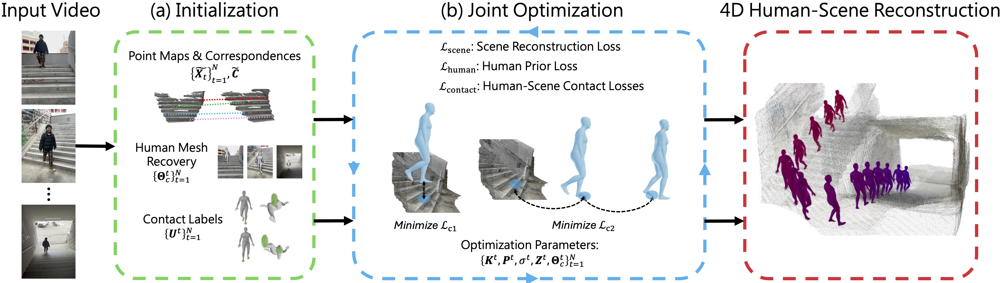

---
layout: research
permalink: /JOSH/
title: "JOSH"
page_title: "Joint Optimization for 4D Human-Scene Reconstruction in the Wild"
description: "<h3>ICLR 2026</h3>"

authors:

- {name: "Zhizheng Liu", url: "https://scholar.google.com/citations?user=Asc7j9oAAAAJ&hl=en"}
- {name: "Joe Lin", url: "https://github.com/joe-lin-tech"}
- {name: "Wayne Wu", url: "https://wywu.github.io/"}
- {name: "Bolei Zhou", url: "https://boleizhou.github.io/"}

institutions:

- {name: "University of California, Los Angeles"}

nav: false
nav_order: 1
code_link: https://github.com/genforce/JOSH
pdf_link: https://arxiv.org/abs/2501.02158

--- 


<div class="embed-responsive embed-responsive-16by9">
  <video muted autoplay playsinline controls loop style="position: absolute; top: 0%; left: 0%; width: 100%; height: 100%;">
        <source src="../assets/projects/josh/demo.mov" type="video/mp4">
        Your browser does not support the video tag.
    </video>
</div>


<!--research-section-splitter-->

## Overview

We propose a novel method <b>JOSH</b> (<u>J</u>oint <u>O</u>ptimization of <u>S</u>cene  Geometry and <u>H</u>uman Motion)  for <b>4D Human-Scene Reconstruction in the wild</b>, which  jointly
  optimizes the <b>global human motion</b>, the <b>surrounding environment</b>, and the <b>camera poses</b> with coherent human-scene interaction given a web video captured from a single camera.
    JOSH uses local scene reconstruction and human mesh recovery as initialization and then jointly optimizes motion and scene 
  with the <b>human-scene contact</b> constraints.  JOSH achieves state-of-the-art performance for both global human motion estimation and metric-scale scene reconstruction with joint optimization.

  We further design an <b>end-to-end</b> model, <b>JOSH3R</b> to predict the relative human transformation directly between two frames,allowing real-time inference as a trade-off to the estimation accuracy.
 
<div class="img-container" style="width: 100%; margin: 0 auto;">
    
</div>
<!--research-section-splitter-->


## Results on Datasets
JOSH surpasses existing methods on both global human motion estimation and metric-scale scene reconstruction by a large margin, and has high potential for scalable training of end-to-end models using extensive web videos.

### Evaluation on Global Human Motion Estimation with the EMDB Dataset
<div class="embed-responsive embed-responsive-16by9">
  <video muted autoplay playsinline controls loop style="position: absolute; top: 0%; left: 0%; width: 100%; height: 100%;">
        <source src="../assets/projects/josh/dataset_1.mov" type="video/mp4">
        Your browser does not support the video tag.
    </video>
</div>

###  Evaluation on Global Camera Trajectory Estimation with the SLOPER4D Dataset
<div class="embed-responsive embed-responsive-16by9">
  <video muted autoplay playsinline controls loop style="position: absolute; top: 0%; left: 0%; width: 100%; height: 100%;">
        <source src="../assets/projects/josh/dataset_2.mov" type="video/mp4">
        Your browser does not support the video tag.
    </video>
</div>

###  Evaluation on 4D Human-Scene Reconstruction with the RICH Dataset
<div class="embed-responsive embed-responsive-16by9">
  <video muted autoplay playsinline controls loop style="position: absolute; top: 0%; left: 0%; width: 100%; height: 100%;">
        <source src="../assets/projects/josh/dataset_3.mov" type="video/mp4">
        Your browser does not support the video tag.
    </video>
</div>

## Interactive Demo on Web Video

<iframe width="100%" height="650" style="border:none" src="https://app.rerun.io/version/0.20.3/?url=https://raw.githubusercontent.com/genforce/JOSH/main/recordings/demo_1.rrd"></iframe>

<!--research-section-splitter-->

## Prior Works


 <div class="citation">
    <div class="image"></div>
    <div class="comment">
      <a href="https://genforce.github.io/PedGen/" target="_blank">
        Zhizheng Liu, Joe Lin, Wayne Wu, Bolei Zhou.
        Learning to Generate Diverse Pedestrian Movements from Web Videos with Noisy Labels.
        ICLR 2025.</a><br>
      <b>Comment:</b>
       This work proposes a dataset and a model for context-aware pedestrian movement generation from pseudo-labels of web videos. We can use JOSH to 
       extract human and scene labels with better quality for pedestrian movement generation.
    </div>
  </div>
 


<!--research-section-splitter-->


## Reference

```
@article{liu2026joint,
    title={Joint Optimization for 4D Human-Scene Reconstruction in the Wild},
    author={Liu, Zhizheng and Lin, Joe and Wu, Wayne and Zhou, Bolei},
    journal={The Fourteenth International Conference on Learning Representations},
    year={2026}
} 
```


<br>

 