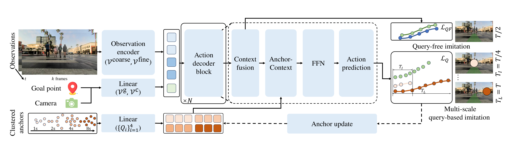
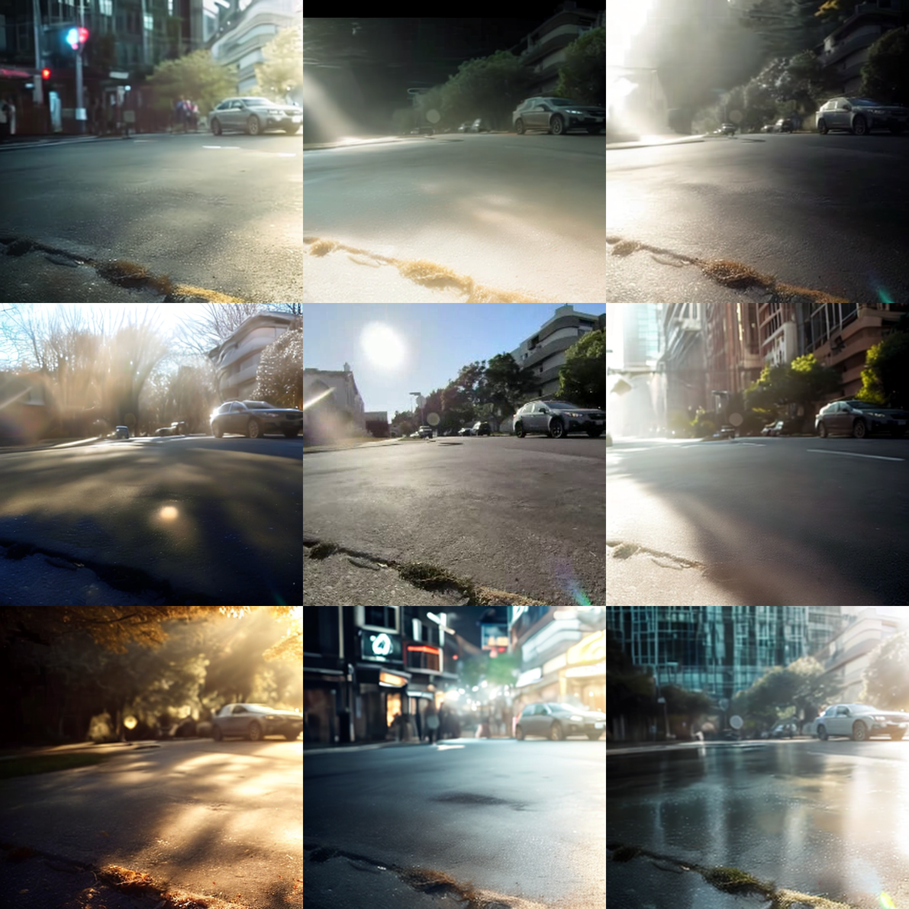
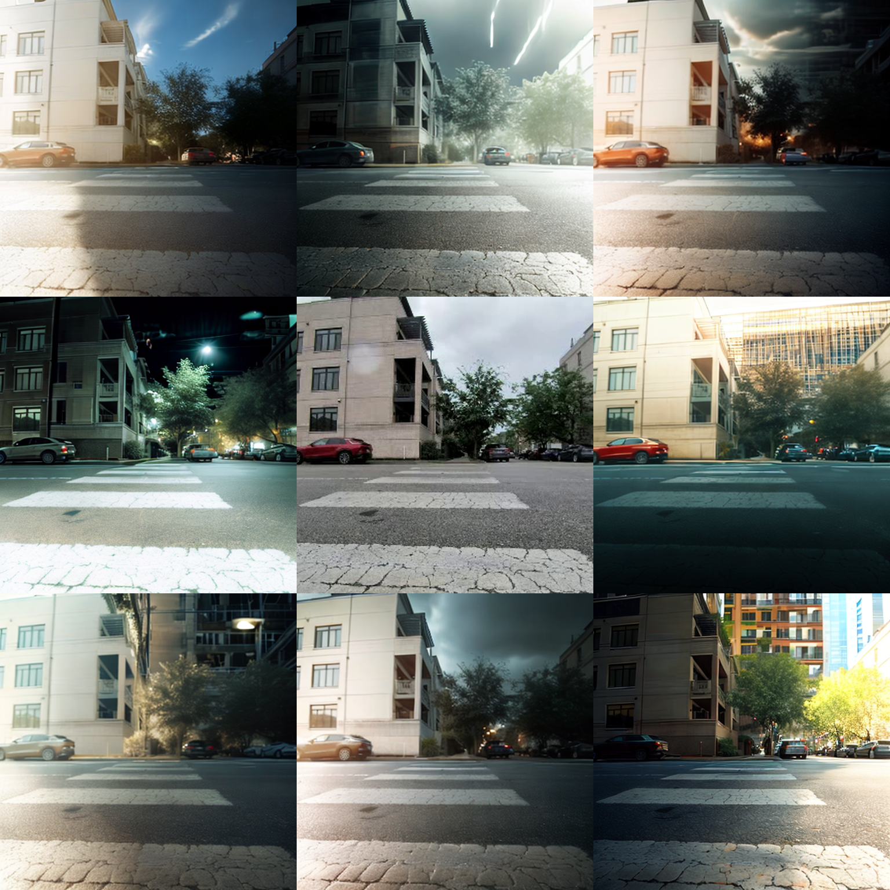
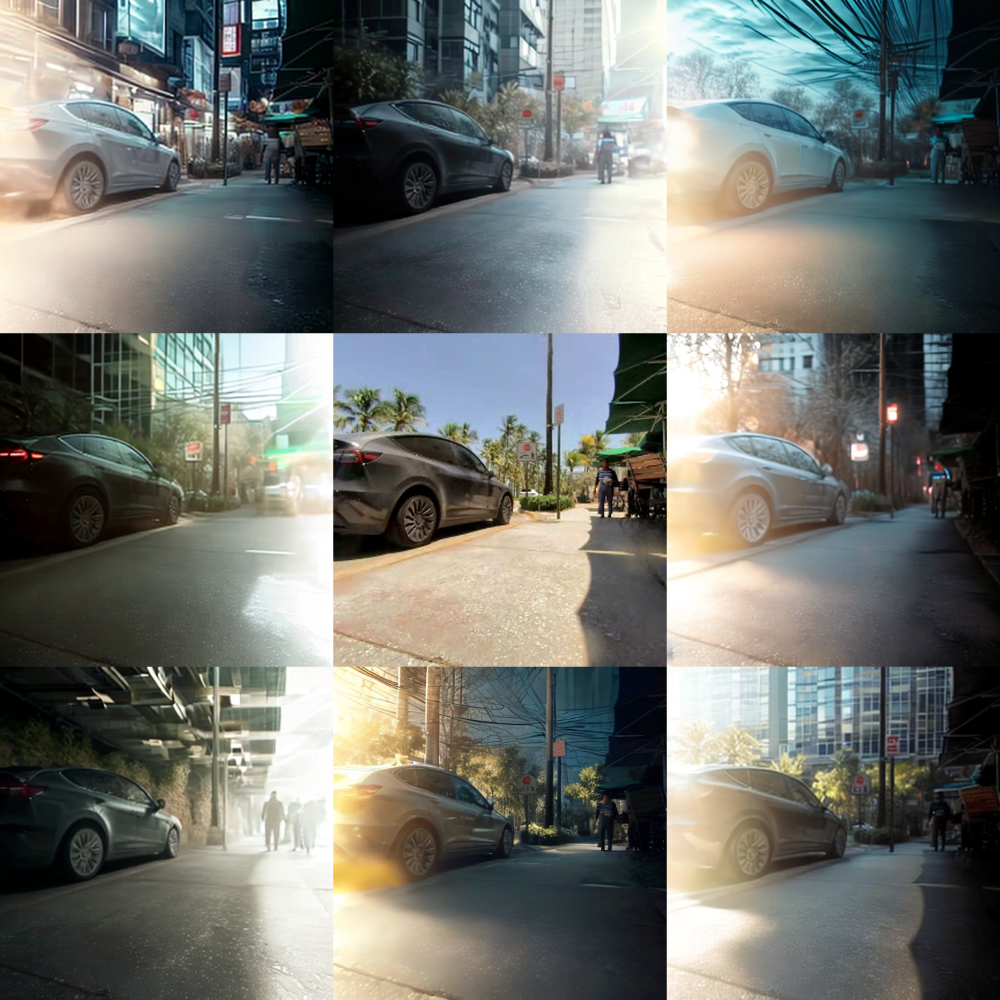

<div class="embed-responsive embed-responsive-16by9">
  <video muted autoplay playsinline controls loop style="position: absolute; top: 0%; left: 0%; width: 100%; height: 100%;">
        <source src="../assets/projects/mimic/teaser.mp4" type="video/mp4">
        Your browser does not support the video tag.
    </video>
</div>
<div style="text-align:center;font-size:14px;color:#444;margin-top:4px;margin-bottom:12px;">We propose a method for training a sidewalk autopilot model that enables mobile robots to navigate autonomously with obstacle avoidance, lane following, and pedestrian awareness. The hardware platform is developed by <a href="https://www.cocodelivery.com/">Coco Robotics</a>.</div>

<div class="research-section">
    <h3 style="text-align: center">TL;DR</h3>
    <ul style="list-style-type: none; padding-left: 0;">
      <strong>MIMIC</strong> (Multi-scale IMItation with Corrective expansions) is an imitation learning framework for training a sidewalk autopilot from teleoperation data. We focus on augmenting training data at both the behavior level and visual diversity through <strong>corrective behavior expansion</strong> and <strong>generative data augmentation</strong>.<br><br>
    1. We introduce a <strong>multi-scale imitation learning</strong> architecture with horizon-specific anchors that jointly captures short-horizon interactive behaviors and long-horizon goal-directed intentions.<br>
    2. We propose <strong>corrective behavior expansion</strong> that synthesizes deviation-recovery trajectories from existing teleoperation data, enabling the policy to learn to recover from its own mistakes.<br>
    3. We adopt <strong>generative data augmentation</strong> to enrich visual diversity while preserving scene geometry, improving robustness to varied lighting and weather conditions.<br>
    4. We demonstrate improvements in real-world closed-loop deployment on diverse sidewalk scenarios.
  </ul>
</div>

<!--research-section-splitter-->

## MIMIC Framework

<div class="img-container" style="width: 100%; margin: 0 auto;">
    
</div>

MIMIC adopts an encoder-decoder architecture that processes RGB observations, and goal signals into a spatiotemporal representation. The action decoder leverages time-horizon-specific anchors to produce actions parameterized by GMMs across multiple horizons, enabling the model to learn both fine-grained reactivity and long-term planning in a unified framework.

<!--research-section-splitter-->

## Corrective Behavior Expansion

We synthesize failure-correction scenarios by deliberately generating trajectories in which the robot deviates from the intended route, and then provide corrective actions as supervision. 

Based on <a href="https://github.com/TrajectoryCrafter/TrajectoryCrafter">TrajectoryCrafter</a>, we perturb the trajectory using a deviation-recovery noise sequence, and re-render novel observations, pairing each perturbed trajectory with a corrective recovery maneuver.

<!-- 4 rows: ori / dev / ori / dev, label column + 3 scenario columns -->
<!-- Row 1-2 small gap (same scenario pair), 2-3 medium gap, 3-4 small gap -->
<div style="display: grid; grid-template-columns: auto 1fr 1fr 1fr; gap: 4px 8px; margin-top: 16px; align-items: center;">

  <!-- Row 1: Original (scenarios 1-3) -->
  <div style="writing-mode: vertical-rl; transform: rotate(180deg); font-size: 13px; font-weight: 600; color: #444; text-align: center; padding: 0 4px;">Original</div>
  <div class="embed-responsive embed-responsive-16by9">
    <video muted autoplay playsinline loop style="position: absolute; top: 0; left: 0; width: 100%; height: 100%;">
      <source src="../assets/projects/mimic/gen_video_4_ori.mp4" type="video/mp4">
    </video>
  </div>
  <div class="embed-responsive embed-responsive-16by9">
    <video muted autoplay playsinline loop style="position: absolute; top: 0; left: 0; width: 100%; height: 100%;">
      <source src="../assets/projects/mimic/gen_video_3_ori.mp4" type="video/mp4">
    </video>
  </div>
  <div class="embed-responsive embed-responsive-16by9">
    <video muted autoplay playsinline loop style="position: absolute; top: 0; left: 0; width: 100%; height: 100%;">
      <source src="../assets/projects/mimic/gen_video_2_ori.mp4" type="video/mp4">
    </video>
  </div>

  <!-- Row 2: Deviated (scenarios 1-3) -->
  <div style="writing-mode: vertical-rl; transform: rotate(180deg); font-size: 13px; font-weight: 600; text-align: center; padding: 0 4px;"><span style="color: #c44;">Deviation</span>-<span style="color: #2a2;">Recovery</span></div>
  <div class="embed-responsive embed-responsive-16by9">
    <video muted autoplay playsinline loop style="position: absolute; top: 0; left: 0; width: 100%; height: 100%;">
      <source src="../assets/projects/mimic/gen_video_4_dev.mp4" type="video/mp4">
    </video>
  </div>
  <div class="embed-responsive embed-responsive-16by9">
    <video muted autoplay playsinline loop style="position: absolute; top: 0; left: 0; width: 100%; height: 100%;">
      <source src="../assets/projects/mimic/gen_video_3_dev.mp4" type="video/mp4">
    </video>
  </div>
  <div class="embed-responsive embed-responsive-16by9">
    <video muted autoplay playsinline loop style="position: absolute; top: 0; left: 0; width: 100%; height: 100%;">
      <source src="../assets/projects/mimic/gen_video_2_dev.mp4" type="video/mp4">
    </video>
  </div>

  <!-- Spacer row between scenario groups -->
  <div style="grid-column: 1 / -1; height: 16px;"></div>

  <!-- Row 3: Original (scenarios 4-6) -->
  <div style="writing-mode: vertical-rl; transform: rotate(180deg); font-size: 13px; font-weight: 600; color: #444; text-align: center; padding: 0 4px;">Original</div>
  <div class="embed-responsive embed-responsive-16by9">
    <video muted autoplay playsinline loop style="position: absolute; top: 0; left: 0; width: 100%; height: 100%;">
      <source src="../assets/projects/mimic/gen_video_5_ori.mp4" type="video/mp4">
    </video>
  </div>
  <div class="embed-responsive embed-responsive-16by9">
    <video muted autoplay playsinline loop style="position: absolute; top: 0; left: 0; width: 100%; height: 100%;">
      <source src="../assets/projects/mimic/gen_video_1_ori.mp4" type="video/mp4">
    </video>
  </div>
  <div class="embed-responsive embed-responsive-16by9">
    <video muted autoplay playsinline loop style="position: absolute; top: 0; left: 0; width: 100%; height: 100%;">
      <source src="../assets/projects/mimic/gen_video_6_ori.mp4" type="video/mp4">
    </video>
  </div>

  <!-- Row 4: Deviated (scenarios 4-6) -->
  <div style="writing-mode: vertical-rl; transform: rotate(180deg); font-size: 13px; font-weight: 600; text-align: center; padding: 0 4px;"><span style="color: #c44;">Deviation</span>-<span style="color: #2a2;">Recovery</span></div>
  <div class="embed-responsive embed-responsive-16by9">
    <video muted autoplay playsinline loop style="position: absolute; top: 0; left: 0; width: 100%; height: 100%;">
      <source src="../assets/projects/mimic/gen_video_5_dev.mp4" type="video/mp4">
    </video>
  </div>
  <div class="embed-responsive embed-responsive-16by9">
    <video muted autoplay playsinline loop style="position: absolute; top: 0; left: 0; width: 100%; height: 100%;">
      <source src="../assets/projects/mimic/gen_video_1_dev.mp4" type="video/mp4">
    </video>
  </div>
  <div class="embed-responsive embed-responsive-16by9">
    <video muted autoplay playsinline loop style="position: absolute; top: 0; left: 0; width: 100%; height: 100%;">
      <source src="../assets/projects/mimic/gen_video_6_dev.mp4" type="video/mp4">
    </video>
  </div>

</div>

<!--research-section-splitter-->

## Generative Data Augmentation

<div style="display: grid; grid-template-columns: 1fr 1fr 1fr; gap: 8px; margin-top: 16px; margin-bottom: 16px;">
  <div>
    
  </div>
  <div>
    
  </div>
  <div>
    
  </div>
</div>

We adopt a fore-background relighting model to enrich visual diversity while preserving scene geometry. 

Based on <a href="https://github.com/bcmi/Light-A-Video">Light-A-Video</a>, we disentangle foreground objects from the background, and apply prompt-based relighting with different strength coefficients to synthesize novel lighting conditions.


<table style="width: 100%; border-collapse: collapse; margin-top: 16px; table-layout: fixed;">
  <tr>
    <td style="padding: 4px; width: 33.33%;"><div class="embed-responsive embed-responsive-16by9"><video muted autoplay playsinline loop style="position:absolute;top:0;left:0;width:100%;height:100%;"><source src="../assets/projects/mimic/sensor_orig_1.mp4" type="video/mp4"></video></div><div style="text-align:center;font-size:11px;color:#666;margin-top:2px;">Original</div></td>
    <td style="padding: 4px; width: 33.33%;"><div class="embed-responsive embed-responsive-16by9"><video muted autoplay playsinline loop style="position:absolute;top:0;left:0;width:100%;height:100%;"><source src="../assets/projects/mimic/sensor_relit_1_1.mp4" type="video/mp4"></video></div><div style="text-align:center;font-size:11px;color:#666;font-style:italic;margin-top:2px;">"icy road with strong reflections from frozen surface"</div></td>
    <td style="padding: 4px; width: 33.33%;"><div class="embed-responsive embed-responsive-16by9"><video muted autoplay playsinline loop style="position:absolute;top:0;left:0;width:100%;height:100%;"><source src="../assets/projects/mimic/sensor_relit_1_2.mp4" type="video/mp4"></video></div><div style="text-align:center;font-size:11px;color:#666;font-style:italic;margin-top:2px;">"commercial street at night with shop signs lit"</div></td>
  </tr>
  <tr>
    <td style="padding: 4px; width: 33.33%;"><div class="embed-responsive embed-responsive-16by9"><video muted autoplay playsinline loop style="position:absolute;top:0;left:0;width:100%;height:100%;"><source src="../assets/projects/mimic/sensor_orig_2.mp4" type="video/mp4"></video></div><div style="text-align:center;font-size:11px;color:#666;margin-top:2px;">Original</div></td>
    <td style="padding: 4px; width: 33.33%;"><div class="embed-responsive embed-responsive-16by9"><video muted autoplay playsinline loop style="position:absolute;top:0;left:0;width:100%;height:100%;"><source src="../assets/projects/mimic/sensor_relit_2_1.mp4" type="video/mp4"></video></div><div style="text-align:center;font-size:11px;color:#666;font-style:italic;margin-top:2px;">"snowfall reducing visibility"</div></td>
    <td style="padding: 4px; width: 33.33%;"><div class="embed-responsive embed-responsive-16by9"><video muted autoplay playsinline loop style="position:absolute;top:0;left:0;width:100%;height:100%;"><source src="../assets/projects/mimic/sensor_relit_2_2.mp4" type="video/mp4"></video></div><div style="text-align:center;font-size:11px;color:#666;font-style:italic;margin-top:2px;">"dusk with half-lit sky"</div></td>
  </tr>
  <tr>
    <td style="padding: 4px; width: 33.33%;"><div class="embed-responsive embed-responsive-16by9"><video muted autoplay playsinline loop style="position:absolute;top:0;left:0;width:100%;height:100%;"><source src="../assets/projects/mimic/sensor_orig_3.mp4" type="video/mp4"></video></div><div style="text-align:center;font-size:11px;color:#666;margin-top:2px;">Original</div></td>
    <td style="padding: 4px; width: 33.33%;"><div class="embed-responsive embed-responsive-16by9"><video muted autoplay playsinline loop style="position:absolute;top:0;left:0;width:100%;height:100%;"><source src="../assets/projects/mimic/sensor_relit_3_1.mp4" type="video/mp4"></video></div><div style="text-align:center;font-size:11px;color:#666;font-style:italic;margin-top:2px;">"rain streaks on glass facades reflecting light"</div></td>
    <td style="padding: 4px; width: 33.33%;"><div class="embed-responsive embed-responsive-16by9"><video muted autoplay playsinline loop style="position:absolute;top:0;left:0;width:100%;height:100%;"><source src="../assets/projects/mimic/sensor_relit_3_2.mp4" type="video/mp4"></video></div><div style="text-align:center;font-size:11px;color:#666;font-style:italic;margin-top:2px;">"sunny afternoon with strong shadows"</div></td>
  </tr>
  <tr>
    <td style="padding: 4px; width: 33.33%;"><div class="embed-responsive embed-responsive-16by9"><video muted autoplay playsinline loop style="position:absolute;top:0;left:0;width:100%;height:100%;"><source src="../assets/projects/mimic/sensor_orig_4.mp4" type="video/mp4"></video></div><div style="text-align:center;font-size:11px;color:#666;margin-top:2px;">Original</div></td>
    <td style="padding: 4px; width: 33.33%;"><div class="embed-responsive embed-responsive-16by9"><video muted autoplay playsinline loop style="position:absolute;top:0;left:0;width:100%;height:100%;"><source src="../assets/projects/mimic/sensor_relit_4_1.mp4" type="video/mp4"></video></div><div style="text-align:center;font-size:11px;color:#666;font-style:italic;margin-top:2px;">"after rain with wet ground reflections"</div></td>
    <td style="padding: 4px; width: 33.33%;"><div class="embed-responsive embed-responsive-16by9"><video muted autoplay playsinline loop style="position:absolute;top:0;left:0;width:100%;height:100%;"><source src="../assets/projects/mimic/sensor_relit_4_2.mp4" type="video/mp4"></video></div><div style="text-align:center;font-size:11px;color:#666;font-style:italic;margin-top:2px;">"evening twilight with streetlights turning on"</div></td>
  </tr>
</table>


<!--research-section-splitter-->

## Real-World Deployment

We evaluate the learned autopilot policy on a wheeled delivery robot developed by <a href="https://www.cocodelivery.com/">Coco Robotics</a>. It uses a front monocular RGB camera as its sole perception input for sidewalk navigation. The policy runs in real time, producing trajectory to generate steering and velocity commands from images and GPS without any HD maps or LiDAR.

<div style="margin-top: 16px;">
  <div class="embed-responsive embed-responsive-16by9">
    <video muted autoplay playsinline loop style="position:absolute;top:0;left:0;width:100%;height:100%;"><source src="../assets/projects/mimic/real_sidewalklane.mp4" type="video/mp4"></video>
  </div>
  <div style="text-align:center;font-size:16px;color:#444;margin-top:4px;margin-bottom:12px;"><b>Sidewalk Lane Following</b> — The robot stays centered within the sidewalk lane, handling narrow paths.</div>

  <div class="embed-responsive embed-responsive-16by9">
    <video muted autoplay playsinline loop style="position:absolute;top:0;left:0;width:100%;height:100%;"><source src="../assets/projects/mimic/real_02.mp4" type="video/mp4"></video>
  </div>
  <div style="text-align:center;font-size:16px;color:#444;margin-top:4px;margin-bottom:12px;"><b>Pedestrian Awareness</b> — The robot yields to oncoming pedestrians, adjusting its trajectory to maintain safe clearance.</div>

  <div class="embed-responsive embed-responsive-16by9">
    <video muted autoplay playsinline loop style="position:absolute;top:0;left:0;width:100%;height:100%;"><source src="../assets/projects/mimic/real_03.mp4" type="video/mp4"></video>
  </div>
  <div style="text-align:center;font-size:16px;color:#444;margin-top:4px;"><b>Complex Real-World Scenario</b> — The robot navigates a cluttered sidewalk with mixed obstacles.</div>
</div>

<!--research-section-splitter-->

## Acknowledgement

We build our pipelines upon <a href="https://github.com/TrajectoryCrafter/TrajectoryCrafter">TrajectoryCrafter</a> for novel-view trajectory synthesis and <a href="https://github.com/bcmi/Light-A-Video">Light-A-Video</a> for video relighting. We thank the authors for open-sourcing their work. 

We thank <a href="https://www.cocodelivery.com/">Coco Robotics</a> for providing the robot platform and teleoperation data used in this work.

<!--research-section-splitter-->

## Reference

```
@inproceedings{he2026learning,
    title={Learning Sidewalk Autopilot from Multi-Scale Imitation with Corrective Behavior Expansion},
    author={Honglin He and Yukai Ma and Brad Squicciarini and Wayne Wu and Bolei Zhou},
    booktitle={2026 IEEE International Conference on Robotics and Automation (ICRA)},
    year={2026},
    organization={IEEE}
}
```
