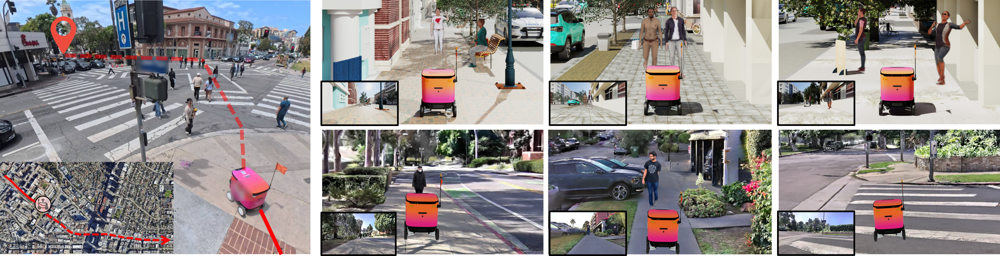
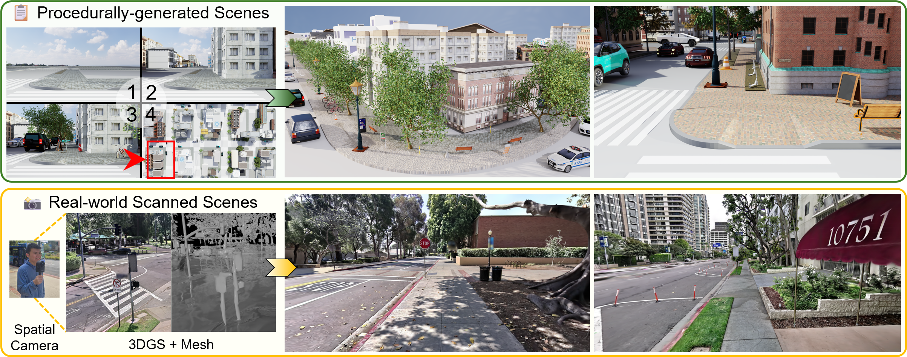
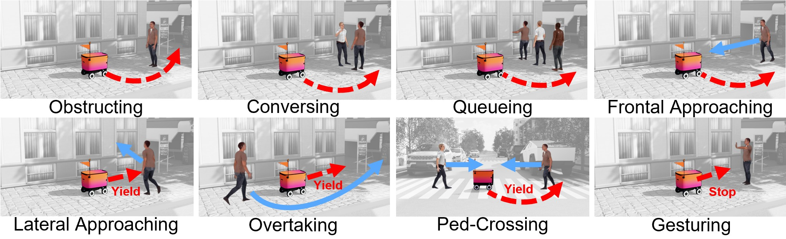
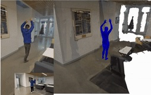

<div class="img-container" style="width: 100%; margin: 0 auto;">
    
</div>

<p style="text-align: center; font-size: 0.85em; font-style: italic; color: #888; margin-top: 4px;">
    Safely navigating complex city streets remains a significant challenge: robots must traverse long distances with varied layouts, avoid static obstacles, and interact safely with dynamic pedestrians. While recent visual navigation models offer promising solutions, the lack of a unified benchmark has hindered quantitative and reproducible evaluation. <strong>SidewalkBench</strong> bridges this gap with a comprehensive simulation platform for standardized model evaluation.
</p>

 

<div class="research-section">
    <h3 style="text-align: center">TL;DR</h3>
    <ul style="list-style-type: none; padding-left: 0;">
      <strong>SidewalkBench</strong> is a comprehensive benchmark for visual navigation on urban sidewalks, built upon NVIDIA Isaac Sim with GPU-accelerated simulation of diverse, high-fidelity sidewalk environments.<br><br>
      1. We introduce two complementary scene types: <strong>procedurally generated scenes</strong> (100 environments of 2km&times;2km) with diverse sidewalk structures and layouts, and <strong>real-world scanned scenes</strong> (11 scenes from 3DGS) with photorealistic visual appearance and geometry.<br>
      2. We develop a two-level pedestrian simulation system with <strong>event-based high-level behaviors</strong> for standardized human-robot interaction testing and a new <strong>SMPL-based animation pipeline</strong> that achieves a 60x rendering efficiency improvement over prior work.<br>
      3. We benchmark 9 representative visual navigation models across <strong>330 unit-test</strong>, <strong>800 pedestrian-reactive</strong>, and <strong>105 long-horizon scenarios</strong>. Key findings: scaling sidewalk data is critical; pedestrian interaction and long-horizon robustness remain bottlenecks; synthetic data finetuning is a promising solution.
  </ul>
</div>

<!--research-section-splitter-->

## SidewalkBench Overview

<div class="img-container" style="width: 100%; margin: 0 auto;">
    
</div>
<br>
SidewalkBench is built on NVIDIA Isaac Sim, leveraging GPU-accelerated physics and realistic camera rendering. It includes two complementary scene types:<br>
(1) <strong>Procedurally Generated Scenes</strong>: We define 7 primitive block types (straight, curve, intersection, etc.) and connect them via spline-based routing to form continuous urban topologies. Each block is divided into 5 functional zones (roads, sidewalks, curbs, road verges, frontage zones) with randomized layouts. We leverage UrbanVerse-100K, a large-scale urban asset database, to populate scenes with diverse sky HDRIs, ground textures, and static objects. This yields 100 large-scale environments, each covering 2 km&times;2 km.<br>
(2) <strong>Real-world Scanned Scenes</strong>: Using a XGRIDS spatial camera with LiDAR and four cameras, we scan and reconstruct street blocks with photorealistic 3DGS appearance and accurate mesh geometry. We collect 11 real-world scanned scenes with an average scale of 150 m&times;150 m, annotated with sidewalk and crosswalk regions.

<!--research-section-splitter-->

## Pedestrian Simulation

<div class="img-container" style="width: 100%; margin: 0 auto;">
    
</div>
<p style="text-align: center; font-style: italic; color: #555; margin-top: 4px;">
 
</p>
<br>
SidewalkBench adopts a two-level approach for pedestrian simulation:<br>
(1) <strong>Event-based High-level Behaviors</strong>: We classify common sidewalk interaction behaviors (obstructing, conversing, queueing, frontal/lateral approaching, overtaking, ped-crossing, gesturing), each triggered by the pedestrian's relative position to the robot via a behavior state machine. This enables standardized, reproducible human-interactive scenarios.<br>
(2) <strong>Flexible and Efficient Low-level Animation</strong>: We represent all pedestrians using the SMPL human body model, enabling full motion control via human motion generation models and datasets. Our custom Nvdiffrast-based pedestrian renderer achieves a 60x improvement in rendering efficiency compared to the native Isaac Sim human animation module, enabling large-scale evaluation in parallel environments.

<!--research-section-splitter-->

## Unit-test Scenarios

<p style="text-align: center; font-size: 0.85em; font-style: italic; color: #888; margin-top: 4px;">
  Unit-test scenarios evaluate model performance across three basic sidewalk structures. All videos are played at 4&times; speed.
</p>

 

### Straight

<p style="text-align: center; font-weight: 600; margin: 0 0 6px 0;">Procedurally Generated</p>
<video muted autoplay playsinline controls loop style="width: 100%; height: auto; display: block; margin-bottom: 18px;">
    <source src="../assets/projects/sidewalkbench/unit_test_straight_pg.mp4" type="video/mp4">
    Your browser does not support the video tag.
</video>

<p style="text-align: center; font-weight: 600; margin: 0 0 6px 0;">Real-world Scanned</p>
<video muted autoplay playsinline controls loop style="width: 100%; height: auto; display: block;">
    <source src="../assets/projects/sidewalkbench/unit_test_straight_scanned.mp4" type="video/mp4">
    Your browser does not support the video tag.
</video>

### Curve

<p style="text-align: center; font-weight: 600; margin: 0 0 6px 0;">Procedurally Generated</p>
<video muted autoplay playsinline controls loop style="width: 100%; height: auto; display: block; margin-bottom: 18px;">
    <source src="../assets/projects/sidewalkbench/unit_test_curve_pg.mp4" type="video/mp4">
    Your browser does not support the video tag.
</video>

<p style="text-align: center; font-weight: 600; margin: 0 0 6px 0;">Real-world Scanned</p>
<video muted autoplay playsinline controls loop style="width: 100%; height: auto; display: block;">
    <source src="../assets/projects/sidewalkbench/unit_test_curve_scanned.mp4" type="video/mp4">
    Your browser does not support the video tag.
</video>

### Crosswalk

<p style="text-align: center; font-weight: 600; margin: 0 0 6px 0;">Procedurally Generated</p>
<video muted autoplay playsinline controls loop style="width: 100%; height: auto; display: block; margin-bottom: 18px;">
    <source src="../assets/projects/sidewalkbench/unit_test_crosswalk_pg.mp4" type="video/mp4">
    Your browser does not support the video tag.
</video>

<p style="text-align: center; font-weight: 600; margin: 0 0 6px 0;">Real-world Scanned</p>
<video muted autoplay playsinline controls loop style="width: 100%; height: auto; display: block;">
    <source src="../assets/projects/sidewalkbench/unit_test_crosswalk_scanned.mp4" type="video/mp4">
    Your browser does not support the video tag.
</video>

 

<!--research-section-splitter-->

## Pedestrian-reactive Scenarios

<p style="text-align: center; font-size: 0.85em; font-style: italic; color: #888; margin-top: 4px;">
  We evaluate 8 types of event-based pedestrian behaviors in procedurally generated scenes. All videos are played at 4&times; speed.
</p>

### Obstructing  

<div style="display: flex; align-items: center; gap: 12px; margin: 0 auto 18px auto;">
  <div style="flex: 1; min-width: 0;">
    <video muted autoplay playsinline controls loop style="width: 100%; height: auto; display: block;">
        <source src="../assets/projects/sidewalkbench/pedestrian_reactive_obstructing.mp4" type="video/mp4">
        Your browser does not support the video tag.
    </video>
  </div>
</div>

### Conversing 

<div style="display: flex; align-items: center; gap: 12px; margin: 0 auto 18px auto;">
  <div style="flex: 1; min-width: 0;">
    <video muted autoplay playsinline controls loop style="width: 100%; height: auto; display: block;">
        <source src="../assets/projects/sidewalkbench/pedestrian_reactive_conversing.mp4" type="video/mp4">
        Your browser does not support the video tag.
    </video>
  </div>
</div>

### Queueing  

<div style="display: flex; align-items: center; gap: 12px; margin: 0 auto 18px auto;">
  <div style="flex: 1; min-width: 0;">
    <video muted autoplay playsinline controls loop style="width: 100%; height: auto; display: block;">
        <source src="../assets/projects/sidewalkbench/pedestrian_reactive_queueing.mp4" type="video/mp4">
        Your browser does not support the video tag.
    </video>
  </div>
</div>

### Frontal Approaching 

<div style="display: flex; align-items: center; gap: 12px; margin: 0 auto 18px auto;">
  <div style="flex: 1; min-width: 0;">
    <video muted autoplay playsinline controls loop style="width: 100%; height: auto; display: block;">
        <source src="../assets/projects/sidewalkbench/pedestrian_reactive_frontal_approaching.mp4" type="video/mp4">
        Your browser does not support the video tag.
    </video>
  </div>
</div>

### Lateral Approaching  

<div style="display: flex; align-items: center; gap: 12px; margin: 0 auto 18px auto;">
  <div style="flex: 1; min-width: 0;">
    <video muted autoplay playsinline controls loop style="width: 100%; height: auto; display: block;">
        <source src="../assets/projects/sidewalkbench/pedestrian_reactive_lateral_approaching.mp4" type="video/mp4">
        Your browser does not support the video tag.
    </video>
  </div>
</div>

### Overtaking  

<div style="display: flex; align-items: center; gap: 12px; margin: 0 auto 18px auto;">
  <div style="flex: 1; min-width: 0;">
    <video muted autoplay playsinline controls loop style="width: 100%; height: auto; display: block;">
        <source src="../assets/projects/sidewalkbench/pedestrian_reactive_overtaking.mp4" type="video/mp4">
        Your browser does not support the video tag.
    </video>
  </div>
</div>

### Ped-Crossing  

<div style="display: flex; align-items: center; gap: 12px; margin: 0 auto 18px auto;">
  <div style="flex: 1; min-width: 0;">
    <video muted autoplay playsinline controls loop style="width: 100%; height: auto; display: block;">
        <source src="../assets/projects/sidewalkbench/pedestrian_reactive_ped_crossing.mp4" type="video/mp4">
        Your browser does not support the video tag.
    </video>
  </div>
</div>

### Gesturing  

<div style="display: flex; align-items: center; gap: 12px; margin: 0 auto 18px auto;">
  <div style="flex: 1; min-width: 0;">
    <video muted autoplay playsinline controls loop style="width: 100%; height: auto; display: block;">
        <source src="../assets/projects/sidewalkbench/pedestrian_reactive_gesturing.mp4" type="video/mp4">
        Your browser does not support the video tag.
    </video>
  </div>
</div>

 

<!--research-section-splitter-->

## Long-horizon Scenarios

<p style="text-align: center; font-size: 0.85em; font-style: italic; color: #888; margin-top: 4px;">
  Long-horizon scenarios require traversing large-scale environments (>100m start-to-goal distance). All videos are played at 4&times; speed.
</p>

 

<p style="text-align: center; font-weight: 600; margin: 0 0 6px 0;">Procedurally Generated</p>
<video muted autoplay playsinline controls loop style="width: 100%; height: auto; display: block; margin-bottom: 18px;">
    <source src="../assets/projects/sidewalkbench/long_horizon_pg.mp4" type="video/mp4">
    Your browser does not support the video tag.
</video>

<p style="text-align: center; font-weight: 600; margin: 0 0 6px 0;">Real-world Scanned</p>
<video muted autoplay playsinline controls loop style="width: 100%; height: auto; display: block;">
    <source src="../assets/projects/sidewalkbench/long_horizon_scanned.mp4" type="video/mp4">
    Your browser does not support the video tag.
</video>

 

<!--research-section-splitter-->

## Finetuning from Synthetic Data

<p style="text-align: center; font-size: 0.85em; font-style: italic; color: #888; margin-top: 4px;">
  Our simulation platform can serve as a scalable synthetic data generator for model finetuning. All videos are played at 4&times; speed.
</p>

### Ped-Crossing

<p style="text-align: center; font-weight: 600; margin: 0 0 6px 0;">Before Finetuning</p>
<video muted autoplay playsinline controls loop style="width: 100%; height: auto; display: block; margin-bottom: 18px;">
    <source src="../assets/projects/sidewalkbench/ped_crossing_before.mp4" type="video/mp4">
    Your browser does not support the video tag.
</video>

<p style="text-align: center; font-weight: 600; margin: 0 0 6px 0;">After Finetuning</p>
<video muted autoplay playsinline controls loop style="width: 100%; height: auto; display: block;">
    <source src="../assets/projects/sidewalkbench/ped_crossing_after.mp4" type="video/mp4">
    Your browser does not support the video tag.
</video>

### Gesturing

<p style="text-align: center; font-weight: 600; margin: 0 0 6px 0;">Before Finetuning</p>
<video muted autoplay playsinline controls loop style="width: 100%; height: auto; display: block; margin-bottom: 18px;">
    <source src="../assets/projects/sidewalkbench/gesturing_before.mp4" type="video/mp4">
    Your browser does not support the video tag.
</video>

<p style="text-align: center; font-weight: 600; margin: 0 0 6px 0;">After Finetuning</p>
<video muted autoplay playsinline controls loop style="width: 100%; height: auto; display: block;">
    <source src="../assets/projects/sidewalkbench/gesturing_after.mp4" type="video/mp4">
    Your browser does not support the video tag.
</video>
 

<!--research-section-splitter-->

## Additional Demos

### Other Robot Embodiments

<div style="display: flex; align-items: center; gap: 12px; margin: 0 auto 18px auto;">
  <div style="flex: 1; min-width: 0;">
    <video muted autoplay playsinline controls loop style="width: 100%; height: auto; display: block;">
        <source src="../assets/projects/sidewalkbench/embodiment.mp4" type="video/mp4">
        Your browser does not support the video tag.
    </video>
  </div>
</div>

### Visualization of Real-world Scanned Scenes

<video muted autoplay playsinline controls loop style="width: 100%; height: auto; display: block;">
    <source src="../assets/projects/sidewalkbench/scanned_scene3.mp4" type="video/mp4">
    Your browser does not support the video tag.
</video>

<video muted autoplay playsinline controls loop style="width: 100%; height: auto; display: block;">
    <source src="../assets/projects/sidewalkbench/scanned_scene6.mp4" type="video/mp4">
    Your browser does not support the video tag.
</video>

<video muted autoplay playsinline controls loop style="width: 100%; height: auto; display: block;">
    <source src="../assets/projects/sidewalkbench/scanned_scene1.mp4" type="video/mp4">
    Your browser does not support the video tag.
</video>

<!--research-section-splitter-->

## Reference

```
@article{liu2026sidewalkbench,
         title={SidewalkBench: Benchmarking Visual Navigation on Urban Sidewalks},
         author={Liu, Zhizheng and He, Honglin and Alumootil, Vivek and Pandya, Akshat and Squicciarini, Brad and Wu, Wayne and Zhou, Bolei},
         journal={arXiv preprint},
         year={2026},
}
```

<!--research-section-splitter-->
## Relevant Work


 <div class="citation">
    <div class="image"></div>
    <div class="comment">
      <a href="https://genforce.github.io/PedGen/" target="_blank">
        Zhizheng Liu, Joe Lin, Wayne Wu, Bolei Zhou.
        Learning to Generate Diverse Pedestrian Movements from Web Videos with Noisy Labels.
        ICLR 2025.</a><br>
      <b>Comment:</b>
       This work proposes a model <b>PedGen</b> for context-aware pedestrian movement generation from pseudo-labels of web videos. We can use PedGen to generate diverse pedestrian movements in SidewalkBench.
    </div>
  </div>

   <div class="citation">
    <div class="image"></div>
    <div class="comment">
      <a href="https://vail-ucla.github.io/JOSH/" target="_blank">
        Zhizheng Liu, Joe Lin, Wayne Wu, Bolei Zhou.
        Joint Optimization for 4D Human-Scene Reconstruction in the Wild.
        ICLR 2026.</a><br>
      <b>Comment:</b>
       This work proposes a method <b>JOSH</b> for reconstructing global human motion and the surrounding environment from in-the-wild videos. We can use JOSH to reconstruct novel pedestrian motion like a stopping gesture and directly use it in SidewalkBench.
    </div>
  </div>
 

<script>
(function () {
  function init() {
    var vids = [].slice.call(document.querySelectorAll('video'));
    vids.forEach(function (v) {
      v.removeAttribute('autoplay');
      v.muted = true;
      v.setAttribute('playsinline', '');
      try { v.preload = 'metadata'; } catch (e) {}
    });
    if (!('IntersectionObserver' in window)) {
      vids.forEach(function (v) { var p = v.play(); if (p && p.catch) p.catch(function () {}); });
      return;
    }
    var io = new IntersectionObserver(function (entries) {
      entries.forEach(function (e) {
        var v = e.target;
        if (e.isIntersecting) { var p = v.play(); if (p && p.catch) p.catch(function () {}); }
        else { v.pause(); }
      });
    }, { threshold: 0.2 });
    vids.forEach(function (v) { io.observe(v); });
  }
  if (document.readyState === 'loading') document.addEventListener('DOMContentLoaded', init);
  else init();
})();
</script>
