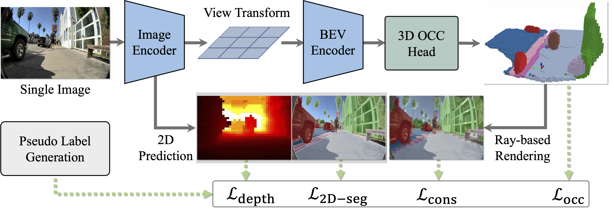
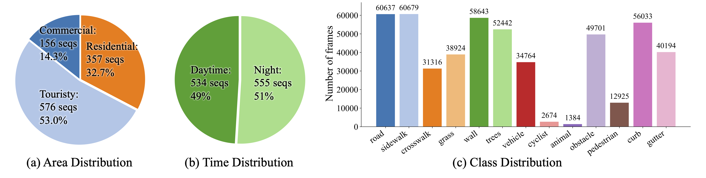

<div class="embed-responsive embed-responsive-16by9">
  <video muted autoplay playsinline controls loop style="position: absolute; top: 0%; left: 0%; width: 100%; height: 100%;">
        <source src="../assets/projects/walkocc/teaser.mp4" type="video/mp4"> 
        Your browser does not support the video tag.
    </video>
</div>

<div class="research-section">
    <h3 style="text-align: center">TL;DR</h3>
    <ul style="list-style-type: none; padding-left: 0;">
    <strong>WalkOCC</strong> is a hybrid ray-marching 3D semantic occupancy learning framework for sidewalk robots that couples geometry grounding from limited paired LiDAR--RGB sequences with scalable learning from large-scale unpaired monocular images, improving robustness and generalization without costly 3D annotations..<br><br>

🧭 It learns reliable sidewalk 3D occupancy from scarce paired sensor data by bootstrapping pseudo-3D supervision, stabilizing training compared to purely self-supervised pipelines.<br>

🧩 It scales to diverse real-world appearances via mixed training on additional 2D-only images, strengthening cross-domain generalization beyond the paired-data distribution.<br>

📦 We introduces <strong>Sidewalk3D</strong>, a large-scale, cross-domain sidewalk perception dataset with LiDAR--camera paired sequences across multiple locations and times, plus 3D semantic occupancy annotations for benchmarking.<br>
  </ul>
</div>

## Visualization of Cross-Embodiment Inference

<!-- ### ✏️ Draft -->

<div class="img-container" style="width: 100%; margin: 0 auto;">
  <video id="robot-player" muted autoplay playsinline controls style="width: 100%; height: auto;">
    <source src="../assets/projects/walkocc/coco.mp4" type="video/mp4">
    Your browser does not support the video tag.
  </video>
</div>

<p id="robot-caption" style="text-align: center; font-size: 0.95rem; color: #666; margin-top: 0.6rem;">
  <strong>Coco Delivery Robot.</strong> A wheeled robot with a front-facing fisheye camera, approximately 40 cm tall, primarily used for last-mile food and parcel delivery on sidewalks.
</p>

<div style="display: flex; justify-content: center; align-items: center; gap: 10px; margin-top: 0.6rem;">
  <button id="robot-prev" type="button" style="padding: 0.35rem 0.7rem; border: 1px solid #ccc; border-radius: 6px; background: #fff;">&#8592; Prev</button>
  <span id="robot-label" style="font-size: 0.95rem; color: #555;">Robot 1 / 3</span>
  <button id="robot-next" type="button" style="padding: 0.35rem 0.7rem; border: 1px solid #ccc; border-radius: 6px; background: #fff;">Next &#8594;</button>
</div>

<script>
  (function() {
    const videos = [
      {
        src: "../assets/projects/walkocc/coco.mp4",
        caption: "<strong>Coco Delivery Robot.</strong> A wheeled robot with a front-facing fisheye camera, approximately 40 cm tall, primarily used for last-mile food and parcel delivery on sidewalks."
      },
      {
        src: "../assets/projects/walkocc/human.mp4",
        caption: "<strong>Booster T1 Humanoid.</strong> A humanoid robot with a front-facing fisheye camera, approximately 1.4 m tall, suited for sidewalk-facing services such as campus patrol, public guidance, and incident reporting."
      },
      {
        src: "../assets/projects/walkocc/dog.mp4",
        caption: "<strong>DEEP Robotics Lynx M20.</strong> A wheeled-legged robot with a front-facing fisheye camera, approximately 0.6 m tall, suitable for sidewalk and curbside inspection, patrol, and light delivery in mixed-terrain areas."
      }
    ];
    let idx = 0;

    const player = document.getElementById("robot-player");
    const label = document.getElementById("robot-label");
    const caption = document.getElementById("robot-caption");
    const prevBtn = document.getElementById("robot-prev");
    const nextBtn = document.getElementById("robot-next");
    if (!player || !label || !caption || !prevBtn || !nextBtn) return;

    function render() {
      player.src = videos[idx].src;
      player.load();
      const playPromise = player.play();
      if (playPromise && typeof playPromise.catch === "function") playPromise.catch(function() {});
      label.textContent = "Robot " + (idx + 1) + " / " + videos.length;
      caption.innerHTML = videos[idx].caption;
    }

    prevBtn.addEventListener("click", function() {
      idx = (idx - 1 + videos.length) % videos.length;
      render();
    });
    nextBtn.addEventListener("click", function() {
      idx = (idx + 1) % videos.length;
      render();
    });
    player.addEventListener("ended", function() {
      idx = (idx + 1) % videos.length;
      render();
    });
  })();
</script>


## Navigation Planning with OCC supervision

<!-- ### ✏️ Draft -->

<div class="img-container" style="width: 100%; margin: 0 auto;">
  <video id="plan-player" muted autoplay playsinline controls style="width: 100%; height: auto;">
    <source src="../assets/projects/walkocc/plan1.mp4" type="video/mp4">
    Your browser does not support the video tag.
  </video>
</div>

<p id="plan-caption" style="text-align: center; font-size: 0.95rem; color: #666; margin-top: 0.6rem;">
  <strong>Case 1.</strong> Coco robot waits for pedestrians and vehicles to pass before the crosswalk.
</p>

<div style="display: flex; justify-content: center; align-items: center; gap: 10px; margin-top: 0.6rem;">
  <button id="plan-prev" type="button" style="padding: 0.35rem 0.7rem; border: 1px solid #ccc; border-radius: 6px; background: #fff;">&#8592; Prev</button>
  <span id="plan-label" style="font-size: 0.95rem; color: #555;">Case 1 / 4</span>
  <button id="plan-next" type="button" style="padding: 0.35rem 0.7rem; border: 1px solid #ccc; border-radius: 6px; background: #fff;">Next &#8594;</button>
</div>

<script>
  (function() {
    const videos = [
      {
        src: "../assets/projects/walkocc/plan1.mp4",
        caption: "<strong>Case 1.</strong> Coco robot waits for pedestrians and vehicles to pass before the crosswalk."
      },
      {
        src: "../assets/projects/walkocc/plan2.mp4",
        caption: "<strong>Case 2.</strong> Seeing the red light, the Coco robot chose to take an alternate route across the crosswalk."
      },
      {
        src: "../assets/projects/walkocc/plan3.mp4",
        caption: "<strong>Case 3.</strong> The Coco robot navigates along urban sidewalks, avoiding bushes and obstacles."
      },
      {
        src: "../assets/projects/walkocc/plan4.mp4",
        caption: "<strong>Case 4.</strong> The Cocorobot encounters a right-angle turn at the end of the pedestrian walkway."
      }
    ];
    let idx = 0;

    const player = document.getElementById("plan-player");
    const label = document.getElementById("plan-label");
    const caption = document.getElementById("plan-caption");
    const prevBtn = document.getElementById("plan-prev");
    const nextBtn = document.getElementById("plan-next");
    if (!player || !label || !caption || !prevBtn || !nextBtn) return;

    function render() {
      player.src = videos[idx].src;
      player.load();
      const playPromise = player.play();
      if (playPromise && typeof playPromise.catch === "function") playPromise.catch(function() {});
      label.textContent = "Case " + (idx + 1) + " / " + videos.length;
      caption.innerHTML = videos[idx].caption;
    }

    prevBtn.addEventListener("click", function() {
      idx = (idx - 1 + videos.length) % videos.length;
      render();
    });
    nextBtn.addEventListener("click", function() {
      idx = (idx + 1) % videos.length;
      render();
    });
    player.addEventListener("ended", function() {
      idx = (idx + 1) % videos.length;
      render();
    });
  })();
</script>


## Diverse Test Set Inference Visualization


<div class="img-container" style="width: 100%; margin: 0 auto;">
  <video id="testset-player" muted autoplay playsinline controls style="width: 100%; height: auto;">
    <source src="../assets/projects/walkocc/testset.mp4" type="video/mp4">
    Your browser does not support the video tag.
  </video>
</div>

<p id="testset-caption" style="text-align: center; font-size: 0.95rem; color: #666; margin-top: 0.6rem;">
  Our proposed <strong>SideWalk3D</strong> dataset captures diverse appearances across regions and time periods (daytime and nighttime), providing a challenging benchmark for urban sidewalk occupancy prediction.
</p>


<!-- ## Model Output Visualization


<div class="img-container" style="width: 100%; margin: 0 auto;">
  <video id="output-player" muted autoplay loop playsinline controls style="width: 100%; height: auto;">
    <source src="../assets/projects/walkocc/modeloutput.mp4" type="video/mp4">
    Your browser does not support the video tag.
  </video>
</div>

<p id="output-caption" style="text-align: center; font-size: 0.95rem; color: #666; margin-top: 0.6rem;">
  <strong>WalkOCC</strong> predicts not only 3D occupancy but also 2D depth and semantic segmentation. In the video, the first row shows pseudo-labels used for supervision, and the second row shows the model's inference results.
</p>


## Automatic Pseudo-Label Generation


<div class="img-container" style="width: 100%; margin: 0 auto;">
  <video id="output-player" muted autoplay loop playsinline controls style="width: 100%; height: auto;">
    <source src="../assets/projects/walkocc/pseudo.mp4" type="video/mp4">
    Your browser does not support the video tag.
  </video>
</div>

<p id="output-caption" style="text-align: center; font-size: 0.95rem; color: #666; margin-top: 0.6rem;">
  <strong>Pseudo-Label Generation</strong>. 
    With pre-calibrated and time-synchronized sensors, we project 3D LiDAR points onto 2D images to inherit per-point semantic labels. We then generate dense occupancy pseudo-labels using the SurroundOcc
</p>


## High-Quality Manual Annotations for the Test Set


<div class="img-container" style="width: 100%; margin: 0 auto;">
  <video id="output-player" muted autoplay loop playsinline controls style="width: 100%; height: auto;">
    <source src="../assets/projects/walkocc/anno.mp4" type="video/mp4">
    Your browser does not support the video tag.
  </video>
</div>

<p id="output-caption" style="text-align: center; font-size: 0.95rem; color: #666; margin-top: 0.6rem;">
  <strong>Refined LiDAR ground-truth examples.</strong> We visualize manually annotated global point clouds from three representative scenarios: tourist area (day), tourist area (night), and commercial district.
</p> -->


## Long-Horizon Inference Visualization


<div class="img-container" style="width: 100%; margin: 0 auto;">
  <video id="output-player" muted autoplay loop playsinline controls style="width: 100%; height: auto;">
    <source src="../assets/projects/walkocc/long.mp4" type="video/mp4">
    Your browser does not support the video tag.
  </video>
</div>

<p id="output-caption" style="text-align: center; font-size: 0.95rem; color: #666; margin-top: 0.6rem;">
  <strong>Long-horizon demo on a wheeled-legged robot dog.</strong> The robot runs along a sidewalk in a residential area in Los Angeles.
</p>


<!--research-section-splitter-->
## WalkOCC Model architecture
<div class="img-container" style="width: 100%; margin: 0 auto;">
  
</div>
We present <strong>WalkOCC</strong>, a hybrid Ray-marching-based occupancy-learning framework for sidewalk occupancy prediction using a monocular RGB camera. Our approach consists of two key components: (i) a depth-aware lifting architecture that transforms front-view images into 3D semantic occupancy grids, and (ii) a hybrid training strategy that leverages both 2D and 3D supervision via a ray-marching-based 2D-3D consistency loss. Enforcing this consistency enables effective learning from large-scale 2D-only data while preserving geometric accuracy, which in turn improves prediction quality and cross-domain generalization. 


<!--research-section-splitter-->
<!-- ## Dataset Distribution
<div class="img-container" style="width: 100%; margin: 0 auto;">
  
</div>
<strong>Data distribution and representative scenes from Sidewalk3D.</strong> Our dataset spans diverse domains, geographic regions, and illumination conditions (day and night). -->

## Reference

```
@article{ma2026monocular,
         title={Monocular 3D Occupancy Perception for Robots on Sidewalks via Hybrid 2D-3D Learning},
         author={Ma, Yukai and Lin, Jeo and Liu, Liu and He, Honglin and Ricketts, Lulu and Squicciarini, Brad and Liu, Yong and Zhou, Bolei},
         journal={arXiv preprint},
         year={2026},
}
```

<script>
// This page has many videos. Browsers cap how many can decode at once, so
// blanket autoplay silently drops or fails the largest clips ("video cannot be
// played"). Instead, play each video only while it is on screen and pause it
// when it scrolls away. The carousel scripts above still control their own
// src/playback on Prev/Next; this only governs visibility-based play/pause.
(function () {
  function init() {
    var vids = [].slice.call(document.querySelectorAll('video'));
    vids.forEach(function (v) {
      v.removeAttribute('autoplay');
      v.muted = true;
      v.setAttribute('playsinline', '');
      try { v.preload = 'metadata'; } catch (e) {}
    });
    if (!('IntersectionObserver' in window)) {
      vids.forEach(function (v) { var p = v.play(); if (p && p.catch) p.catch(function () {}); });
      return;
    }
    // rootMargin starts each clip ~600px before it enters the viewport (and keeps
    // it running ~600px past the edges), so videos are already playing by the time
    // you see them -- it feels like autoplay. threshold 0 = any overlap counts.
    // Far-off clips still pause, keeping concurrent decodes under the browser cap.
    var io = new IntersectionObserver(function (entries) {
      entries.forEach(function (e) {
        var v = e.target;
        if (e.isIntersecting) { var p = v.play(); if (p && p.catch) p.catch(function () {}); }
        else { v.pause(); }
      });
    }, { rootMargin: '600px 0px', threshold: 0 });
    vids.forEach(function (v) { io.observe(v); });
  }
  if (document.readyState === 'loading') document.addEventListener('DOMContentLoaded', init);
  else init();
})();
</script>
